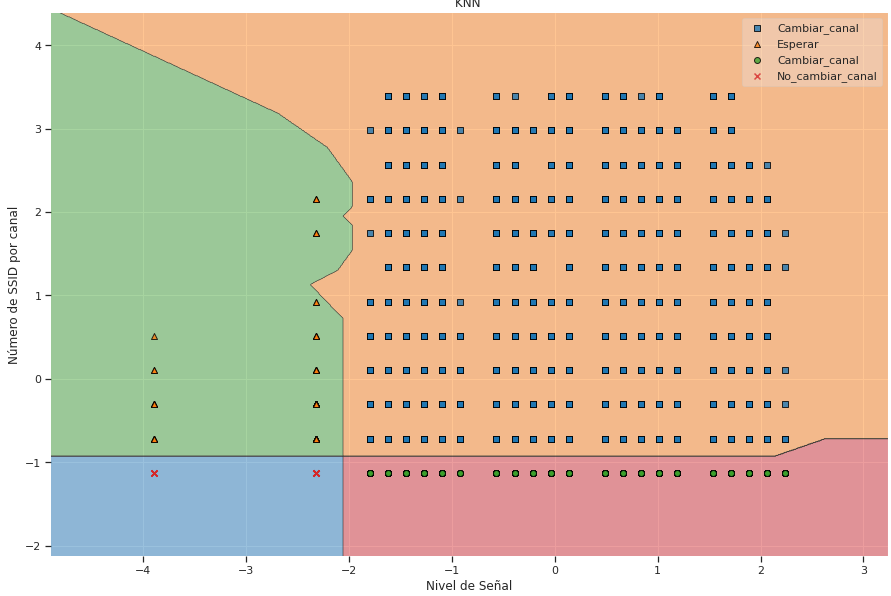
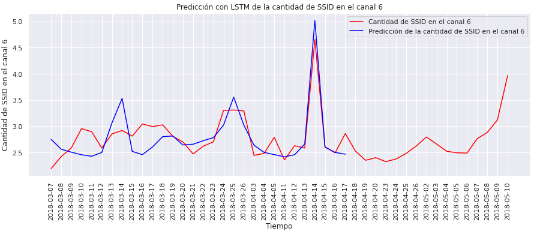

# 🛰️ Optimización de Espectro WiFi mediante KNN y LSTM

Este repositorio representa mi **primer proyecto de integración tecnológica**, desarrollado como parte de mi formación en la **Maestría en Inteligencia Artificial (UNIR)**. El objetivo es resolver un problema crítico en telecomunicaciones: la planificación eficiente de canales en la banda de 2.4 GHz mediante modelos predictivos.

## 📝 El Desafío de Ingeniería
En entornos densos, la interferencia co-canal y de canal adyacente degrada significativamente la calidad del servicio (**QoS**). En este sentido, identifiqué la necesidad de pasar de una planificación estática a una **gestión dinámica basada en datos**.

La idea es identificar y cuantificar el nivel de interferencia en cada canal. Para esto, se ha considerado la densidad de **SSID** presentes por muestra y el nivel de señal (**RSSI**) de cada punto de acceso inalámbrico.

## 🛠️ Stack Tecnológico
* **Lenguaje:** Python (Pandas, NumPy).
* **Deep Learning:** TensorFlow / Keras (Arquitectura LSTM).
* **Machine Learning:** Scikit-Learn (Algoritmo KNN).
* **Procesamiento:** StandardScaler para normalización de señales (dBm).
* **Entorno:** Google Colab / Jupyter Notebook.

## 🧠 Metodología: Comparativa de Modelos
El proyecto evalúa dos enfoques distintos para la toma de decisiones:
1. **K-Nearest Neighbors (KNN):** Implementado para clasificar niveles de interferencia basados en la proximidad y potencia de señal.
2. **Long Short-Term Memory (LSTM):** Red neuronal recurrente diseñada para capturar la naturaleza temporal de las señales, permitiendo predecir comportamientos futuros del espectro.

## 📊 Resultados y Análisis de Entrenamiento

El análisis comparativo validó que las arquitecturas recurrentes son superiores para este problema físico debido a su capacidad de memoria temporal.

### Rendimiento del Modelo LSTM (Deep Learning)
Para garantizar la convergencia total del modelo y capturar patrones de interferencia complejos, se realizó un entrenamiento extendido de **800 épocas**:
* **Convergencia de Pérdida (Loss):** El modelo inició con un error (MSE) de **0.0923** y finalizó en **0.0096**, logrando una reducción del error del **89.5%**.
* **Estabilidad:** La curva de aprendizaje muestra un descenso fluido, validando que el uso de capas **Dropout** evitó el sobreajuste (*overfitting*) a pesar del alto número de iteraciones.
* **Capacidad de Predicción:** A diferencia de KNN, la red LSTM logró seguir la tendencia de atenuación y ruido, permitiendo anticipar zonas de sombra en la cobertura.

### Visualización de Resultados

| Clasificación por Canales (KNN) | Análisis Temporal (LSTM) |
| :---: | :---: |
|  |  |

* **Figura 1 (Izquierda):** Distribución de señales y niveles de potencia por canal para identificar saturación de espectro.
* **Figura 2 (Derecha):** Análisis temporal que demuestra la convergencia exitosa hacia el mínimo global del error.

## 📂 Estructura del Proyecto
* `Estudio_canal_wifi_1.ipynb`: Notebook con el flujo completo de EDA, entrenamiento y evaluación de modelos.
* `wifi_data.csv`: Dataset con métricas reales (SSID, MAC, Vendor, Signal Strength).

---
**Perfil del Autor:**
Soy **Christian Cadena**, especializado en Electrónica, Telecomunicaciones e IA. Este proyecto marca el inicio de mi trayectoria integrando el desarrollo de software y la Inteligencia Artificial en el sector de la infraestructura tecnológica.
